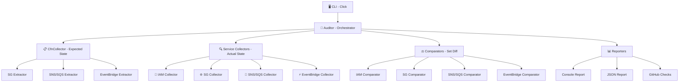

# 🛡️ cfn-drift-extended

[](LICENSE)
[](https://www.python.org/downloads/)
[](#-development)
[](#-supported-services)
[](#-github-action-usage)

Detect **additive drift** in CloudFormation-managed resources that native drift detection misses.

---

## 📋 Table of Contents

- [The Problem](#-the-problem)
- [Supported Services](#-supported-services)
- [Installation](#-installation)
- [Quick Start](#-quick-start)
- [IAM Permissions](#-required-iam-permissions-least-privilege)
- [Exit Codes](#-exit-codes)
- [Example Output](#-example-output)
- [JSON Report Format](#-json-report-format)
- [GitHub Action](#-github-action-usage)
- [Architecture](#-architecture)
- [Design Principles](#-design-principles)
- [Performance](#-performance-characteristics)
- [Troubleshooting](#-troubleshooting)
- [Development](#-development)
- [Contributing](#-contributing)
- [License](#-license)

---

## 🔍 The Problem

CloudFormation drift detection only catches modifications or deletions to resources it manages. It completely misses **additive changes** — for example:

- 🔓 A manually attached IAM policy on a CDK-managed role
- 🌐 An extra security group ingress rule opening SSH to the world
- 📨 An unauthorized SNS subscription exfiltrating data
- 📋 An extra SQS policy statement granting public access
- ⚡ A rogue EventBridge rule routing events to unintended targets

**CloudFormation says "IN_SYNC" for all of these.** This tool catches them.

> **Real-world example:** A reconciliation job failed in QA but worked in Dev. Root cause: someone had manually attached a broader IAM policy to the orchestrator role in Dev. CloudFormation showed "IN_SYNC" because the manual addition wasn't a modification — it was an extra policy CFN didn't know about.

---

## 🎯 Supported Services

| Service | Drift Detected | Severity |
|---------|---------------|----------|
| 🔐 **IAM Roles** | Extra inline policies, extra managed policies, modified policy documents | HIGH |
| 🌐 **Security Groups** | Extra ingress rules (attack surface), extra egress rules (exfiltration) | HIGH / MEDIUM |
| 📨 **SNS Topics** | Extra policy statements, extra subscriptions | HIGH / MEDIUM |
| 📋 **SQS Queues** | Extra resource policy statements | HIGH |
| ⚡ **EventBridge** | Extra rules on CFN-managed event buses | MEDIUM |
| 🔧 **Lambda** | Extra environment variables, extra layers, extra resource-based permissions | HIGH / MEDIUM |
| 🪣 **S3** | Extra bucket policy statements, extra lifecycle rules, extra CORS rules | HIGH / MEDIUM / LOW |
| 🗄️ **DynamoDB** | Extra Global Secondary Indexes, extra auto-scaling targets/policies | MEDIUM |

---

## 📦 Installation

```bash
pip install cfn-drift-extended
```

**Requirements:** Python 3.11+

---

## 🚀 Quick Start

```bash
# Audit all stacks starting with "my-app"
cfn-drift-extended audit --stack-prefix my-app --region us-east-1

# Audit specific stacks by name
cfn-drift-extended audit --stack-name my-stack-prod --region us-east-1

# Filter by tags
cfn-drift-extended audit --stack-prefix my-app --tag Environment=Production --region us-east-1

# Write JSON report for CI/CD
cfn-drift-extended audit --stack-prefix my-app --output-json report.json

# Don't fail on drift (just report)
cfn-drift-extended audit --stack-prefix my-app --no-fail-on-drift

# Audit only specific services
cfn-drift-extended audit --stack-prefix my-app --services iam,sg

# Verbose mode for debugging
cfn-drift-extended audit --stack-prefix my-app -v

# Control concurrency (default: 10 parallel workers)
cfn-drift-extended audit --stack-prefix my-app --max-workers 5
```

---

## 🔒 Required IAM Permissions (Least Privilege)

This tool uses **read-only** AWS API calls exclusively. No write operations are performed.

```json
{
  "Version": "2012-10-17",
  "Statement": [
    {
      "Sid": "CfnDriftExtendedReadOnly",
      "Effect": "Allow",
      "Action": [
        "cloudformation:ListStacks",
        "cloudformation:GetTemplate",
        "cloudformation:DescribeStacks",
        "cloudformation:DescribeStackResource",
        "cloudformation:ListStackResources",
        "iam:GetRole",
        "iam:GetRolePolicy",
        "iam:ListRolePolicies",
        "iam:ListAttachedRolePolicies",
        "ec2:DescribeSecurityGroups",
        "ec2:DescribeSecurityGroupRules",
        "sqs:GetQueueAttributes",
        "sns:GetTopicAttributes",
        "sns:ListSubscriptionsByTopic",
        "events:DescribeEventBus",
        "events:ListRules",
        "events:ListTargetsByRule",
        "lambda:GetFunctionConfiguration",
        "lambda:GetPolicy",
        "s3:GetBucketPolicy",
        "s3:GetBucketLifecycleConfiguration",
        "s3:GetBucketCors",
        "dynamodb:DescribeTable",
        "application-autoscaling:DescribeScalableTargets",
        "application-autoscaling:DescribeScalingPolicies",
        "sts:GetCallerIdentity"
      ],
      "Resource": "*"
    }
  ]
}
```

> 💡 For tighter scoping, restrict `Resource` to specific stack ARNs, role ARNs, security group IDs, queue ARNs, topic ARNs, and event bus ARNs.

---

## 📊 Exit Codes

| Code | Meaning |
|------|---------|
| `0` | ✅ No drift detected (or `--no-fail-on-drift` used) |
| `1` | ⚠️ Additive drift detected |
| `2` | ❌ Error (permission denied, invalid input, unexpected failure) |

---

## 📝 Example Output

```
════════════════════════════════════════════════════════════════
  cfn-drift-extended — Additive Drift Report
════════════════════════════════════════════════════════════════
  Stacks scanned:    2
  Resources scanned: 9
  Resources drifted: 7

⚠ Found 10 drift finding(s) across 7 resource(s):

  [HIGH] my-orchestrator-role (my-app-stack)
         Managed policy 'arn:aws:iam::123456789012:policy/ManualBroadAccess'
         is attached to role but is not declared in the CloudFormation template
         + arn:aws:iam::123456789012:policy/ManualBroadAccess

  [HIGH] sg-0b7a2542ddb09edd6 (my-app-stack)
         Ingress rule (tcp 22-22 0.0.0.0/0) exists on security group
         but is not declared in the CloudFormation template
         + ('tcp', 22, 22, '0.0.0.0/0', None, None, None)

  [MEDIUM] my-event-bus (my-app-stack)
         Rule 'sneaky-exfil-rule' exists on event bus but is not declared
         in the CloudFormation template
         + sneaky-exfil-rule
```

---

## 📄 JSON Report Format

```json
{
  "tool_version": "0.1.0",
  "account_id": "123456789012",
  "region": "us-east-1",
  "timestamp": "2026-05-20T14:30:00+00:00",
  "stacks_scanned": 3,
  "resources_scanned": 12,
  "resources_with_drift": 2,
  "findings": [
    {
      "resource_type": "AWS::IAM::Role",
      "resource_id": "my-role",
      "stack_name": "my-stack",
      "drift_type": "managed_policy_attached",
      "severity": "high",
      "description": "Managed policy 'arn:...' is attached but not in template",
      "expected": ["arn:aws:iam::aws:policy/AWSLambdaBasicExecutionRole"],
      "actual": ["arn:aws:iam::aws:policy/AWSLambdaBasicExecutionRole", "arn:aws:iam::aws:policy/AdministratorAccess"],
      "extra": "arn:aws:iam::aws:policy/AdministratorAccess"
    }
  ],
  "errors": []
}
```

---

## ⚙️ GitHub Action Usage

```yaml
- uses: mopyle4/cfn-drift-extended@v0.1
  with:
    stack-prefix: "my-app"
    region: "us-east-1"
    services: "iam,sg,sns,sqs,eventbridge"  # optional, default: all
    fail-on-drift: "true"
    output-json: "drift-report.json"
```

**Outputs:**
- `drift-detected` — `true` or `false`
- `findings-count` — number of drift findings

---

## 🏗️ Architecture



| Component | Responsibility |
|-----------|---------------|
| **CLI** | Argument parsing, output formatting, exit codes |
| **Auditor** | Orchestrates the pipeline with parallel execution |
| **CfnCollector** | Extracts expected state from CloudFormation templates |
| **Service Collectors** | Fetches actual state from AWS APIs (IAM, EC2, SQS, SNS, Events) |
| **CfnExtractors** | Resolves intrinsics (Ref, GetAtt, Sub) in template resources |
| **Comparators** | Diffs expected vs actual using set operations (O(n)) |
| **Reporters** | Formats results for console, JSON, or GitHub Checks |

---

## 🧠 Design Principles

| Principle | Implementation |
|-----------|---------------|
| 🔒 **Least Privilege** | Read-only API calls only; no write operations |
| 📐 **SOLID** | Single responsibility per module; dependency injection via constructor |
| 🧊 **Immutable Models** | Frozen Pydantic models and frozen dataclasses prevent mutation |
| 🛟 **Graceful Degradation** | Individual resource failures don't crash the audit |
| ⚡ **Performance** | Parallel auditing via ThreadPoolExecutor; set operations for O(n) comparison |
| 🔄 **Adaptive Retry** | Exponential backoff with jitter (boto3 adaptive mode, 5 max attempts) |
| 🏭 **CI/CD Ready** | Exit codes, JSON output, `--services` filter, and `--fail-on-drift` flag |

---

## ⚡ Performance Characteristics

| Metric | Value |
|--------|-------|
| **Time complexity** | O(S × R) where S = stacks, R = resources per stack |
| **Comparison** | O(n) set-based diff per resource |
| **Concurrency** | Configurable thread pool (default 10 workers) |
| **Memory** | Frozen dataclasses with `__slots__` (~40% less per instance) |
| **Network** | Adaptive retry with exponential backoff prevents throttling |
| **Validated** | 10 true findings, 0 false positives on live Isengard stack |

---

## 🔧 Troubleshooting

| Symptom | Cause | Fix |
|---------|-------|-----|
| Exit code 2 with "Permission denied" | Missing IAM permissions | Add the required permissions from the policy above |
| No stacks found | Prefix doesn't match or stacks are in non-terminal state | Check stack names with `aws cloudformation list-stacks` |
| Slow execution | Many resources across many stacks | Increase `--max-workers` or narrow `--stack-prefix` |
| False positives on CDK stacks | CDK generates `AWS::IAM::Policy` resources separately | Already handled — external policies are associated with their target roles |
| Intrinsic resolution failures | Template uses complex Fn::Sub or nested intrinsics | File an issue — we handle Ref, GetAtt, and Sub but edge cases may exist |

---

## 🛠️ Development

```bash
# Clone and install in dev mode
git clone git@ssh.code.aws.dev:personal_projects/alias_m/mopyle/cfn-drift-extended.git
cd cfn-drift-extended
python3 -m venv .venv
source .venv/bin/activate
pip install -e ".[dev]"

# Run tests (137 tests)
pytest --cov=cfn_drift_extended --cov-report=term-missing

# Lint
ruff check src/ tests/

# Type check
mypy src/

# Run integration tests (requires AWS credentials)
cd integration-tests
./deploy.sh
./introduce-drift.sh
./validate.sh
./cleanup.sh
```

---

## 🤝 Contributing

See [CONTRIBUTING.md](CONTRIBUTING.md) for guidelines.

**Adding a new service collector:** Follow the pattern in the [design doc](docs/new-service-collectors-design.md). Each service needs:
1. Collector (frozen dataclass + boto3 client class)
2. CfnExtractor (template → expected state)
3. Comparator (set-based diff → findings)
4. Tests (happy path, drift detected, not found, permission denied, edge cases)

---

## 📄 License

MIT — see [LICENSE](LICENSE) for details.
